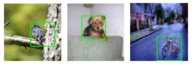
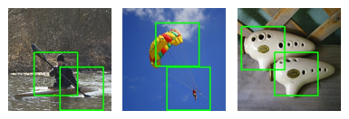

# Localizing Semantic Patches for Accelerating Image Classification

This project provides source code for our Localizing Semantic Patches for Accelerating Image Classification.

## Installation

### Requirements

Ubuntu 18.04 LTS

Python 3.8 ([Anaconda](https://www.anaconda.com/) is recommended)

CUDA 11.1

PyTorch 1.8.0

NCCL for CUDA 11.1

Backbones pretrained on the original ImageNet:
* [densenet201.pth](https://drive.google.com/file/d/1QLDA1UQla1r5tArxrjmLZftNpn64xvRL/view?usp=sharing) 


## Perform experiments on ImageNet dataset

### Dataset preparation

- Download the ImageNet dataset to YOUR_IMAGENET_PATH and move validation images to labeled subfolders
    - The [script](https://raw.githubusercontent.com/soumith/imagenetloader.torch/master/valprep.sh) may be helpful.

- Create a datasets subfolder and a symlink to the ImageNet dataset

```
$ ln -s PATH_TO_YOUR_IMAGENET ./data/
```
Folder of ImageNet Dataset:
```
data/ImageNet
├── train
├── val
```

### Training the upstream AnchorNet
```
python train_anchornet.py \
    --data [your imagenet path] \
    --checkpoint-dir [your path to store checkpoints]
```
| Network | Pre-trained model |
| -- | -- |
|  AnchorNet | [anchornet.pth](https://drive.google.com/file/d/1bLb5FqYAJ64upDz2jD0s5pQFXE4xjB2q/view?usp=sharing) |

### Training the downstream classification network

(1) Training the downstream network with resized images
```
python train_downnet_resized.py \
    --arch densenet201 \
    --data  [your imagenet path] \
    --checkpoint-dir [your path to store checkpoints] \
    --pretrained-downnet [your pretrained model path]/densenet201.pth
```

(2) Training the downstream network with localized patches
```
python train_downnet_patch.py \
    --arch densenet201 \
    --checkpoint-dir [your path to store checkpoints] \
    --pretrained-anchornet [your pretrained anchornet path]/anchornet.pth \
    --pretrained-downnet [your pretrained model path]/densenet201.pth
```

| Network | Pre-trained model |
| -- | -- |
|  DenseNet201_resized | [densenet201_resized_95_best.pth.tar](https://drive.google.com/file/d/14vabr_lUMPOgWow0MTQvf0oxQyKKhxkm/view?usp=sharing) |
|  DenseNet201_patch | [densenet201_patch_95_best.pth.tar](https://drive.google.com/file/d/1H64C9An4uk0ECYkDfGWvkt7IT2UAuMcW/view?usp=sharing) |


### Evaluate the downstream classification network

Make two tables named "threshold" and "predictions", the size of them is N * top_k, where N is the number of test images, top_k is the patch number of an image.

An example of the threshold table, where the value denotes the confidence of ensemble logits from top_k patches

| Sample | 1 | 2 | ... | top_k |
| -- | -- | -- | -- | -- |
| 1 |0.56 |0.77|...|0.85 |
| 2 | 0.78 | 0.88 | ...| 0.97 |
| ... | ... |... |... |... |
| 50K | 0.34|0.43|... |0.55 |

An example of the predictions table, where the value denotes the predicted class label according to the ensemble logits
| Sample | 1 | 2 | ... | top_k |
| -- | -- | -- | -- | -- |
| 1 |2 |1|...|1 |
| 2 | 3 | 3 | ...| 3 |
| ... | ... |... |... |... |
| 50K | 997|997|... |999 |

Generate the tables:
```
python make_table.py \
    --arch densenet201 \
    --topk 5 \
    --iou-thresholds 0.3 0.3 0.3 0.3 \
    --data [your imagenet path] \
    --save-dir [your path to store resulting files] \
    --pretrained-anchornet [your pretrained anchornet path]/anchornet.pth \
    --resized-pretrained [your path]/densenet201_resized_95_best.pth.tar \
    --patch-pretrained [your path]/densenet201_patch_95_best.pth.tar 
```

dynamic inference under various thresholds:

```
python dynamic_inference.py \
    --arch densenet201 \
    --table-file ./result/densenet201_95_0.3_0.pth
```

You can modify the `all_predefined_thresholds` to control various thresholds. Some datapoint examples are shown in [densenet_acc_flops.txt](https://github.com/winycg/AnchorNet/blob/main/result/densenet_acc_flops.txt).


### Visualize the localized patches
```
python visualize.py --topk 1 \
    --save-dir [your path to store localized images] \
    --pretrained-anchornet [your pretrained anchornet path]/anchornet.pth \
```

| Top-1 patches | 
| -- |
|  |

| Top-2 patches | 
| -- |
|  |

```
@inproceedings{yang2022localizing,
  title={Localizing Semantic Patches for Accelerating Image Classification},
  author={Chuanguang Yang, Zhulin An, Yongjun Xu},
  booktitle={IEEE International Conference on Multimedia and Expo},
  year={2022}
}
```